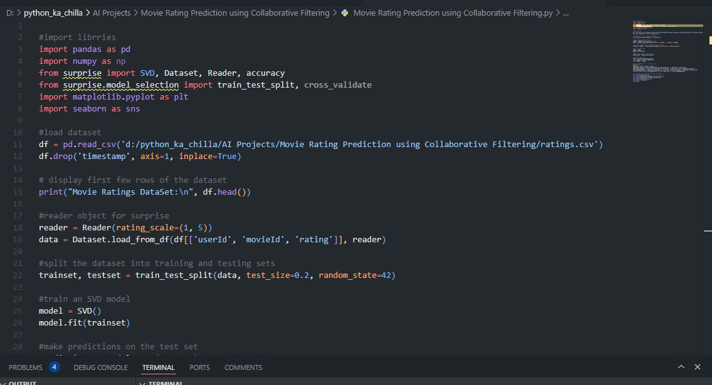

# 🎬 Movie Rating Prediction using Collaborative Filtering 🍿  
      

<p align="center">
  
</p>

🚀 This project builds a **collaborative filtering** model using **Singular Value Decomposition (SVD)** to predict user ratings for movies. It uses the popular **MovieLens dataset** and the `surprise` library. The model not only predicts ratings but also generates **top‑N movie recommendations** for any user, complete with a distribution plot of predicted ratings.

---

## ✨ Key Features  
🎥 **SVD Collaborative Filtering** – Matrix factorization for rating prediction  
📊 **MovieLens Dataset** – Real-world movie ratings (userId, movieId, rating)  
📈 **Model Evaluation** – RMSE metric on test set  
🔮 **Personalized Recommendations** – Top 10 movies for a given user  
📉 **Rating Distribution Visualization** – Histogram with KDE of predicted ratings  
🧠 **Easy to Extend** – Built on the flexible `surprise` library  

---

## 🧠 Tech Stack  
- **Language:** Python 🐍  
- **Libraries:** pandas, numpy, scikit‑surprise, matplotlib, seaborn  
- **Model:** SVD (Singular Value Decomposition)  
- **Dataset:** MovieLens (ratings.csv)  

---

## 📦 Installation  

```bash
git clone https://github.com/SayabArshad/Movie-Rating-Prediction-Collaborative-Filtering.git
cd Movie-Rating-Prediction-Collaborative-Filtering
pip install pandas numpy scikit-surprise matplotlib seaborn
````
⚙️ Note: You need to download the MovieLens dataset (ratings.csv) from GroupLens. Place the file in the project folder. The script expects a CSV with columns userId, movieId, rating, and timestamp (the timestamp column is dropped automatically).

---

## ▶️ Usage

Run the main script:

```bash
python "Movie Rating Prediction using Collaborative Filtering.py"
```

The script will:

Load and preprocess the ratings dataset.

Split the data into training (80%) and test (20%) sets.

Train an SVD model.

Print the RMSE on the test set.

Generate top‑10 movie recommendations for a specific user (default: user 1).

Show a distribution plot of all predicted ratings for that user.

---

## 📁 Project Structure

```
Movie-Rating-Prediction-Collaborative-Filtering/
│-- Movie Rating Prediction using Collaborative Filtering.py   
│-- ratings.csv                                                 
│-- README.md                                                    
│-- assets/                                                     
│    └── code.JPG

```
---

## 🖼️ Interface Previews

G	


---

## 💡 About the Project

Collaborative filtering is a cornerstone of modern recommender systems. This project implements SVD, a matrix factorization technique, to predict how a user would rate a movie they haven’t seen. Using the MovieLens dataset, the model learns latent factors representing users and movies. The RMSE on the test set gives an indication of prediction accuracy. Beyond evaluation, the script demonstrates how to generate personalized recommendations – a practical application seen in services like Netflix and Amazon. The included visualization helps understand the distribution of predicted ratings for a chosen user.

---

## 🧑‍💻 Author

**Developed by:** [Sayab Arshad Soduzai](https://github.com/SayabArshad) 👨‍💻

📅 **Version:** 1.0.0

📜 **License:** MIT License


---

## ⭐ Contributions

Contributions are welcome! Fork the repository, open issues, or submit pull requests to enhance functionality (e.g., adding more algorithms, hyperparameter tuning, or building a web interface).
If you find this project helpful, please ⭐ star the repository to show your support.

---

## 📧 Contact

For queries, collaborations, or feedback, reach out at **[sayabarshad789@gmail.com](mailto:sayabarshad789@gmail.com)**

---

🎥 Predicting your next favorite movie, one rating at a time.

---
